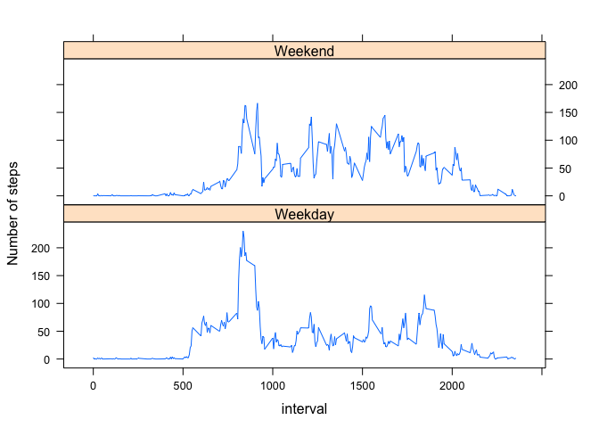

# Reproducible Research: Peer Assessment 1
LHS  
13 Dec 2014  

## Data
This assignment makes use of data from a personal activity monitoring device. This device collects data at 5 minute intervals through out the day. The data consists of two months of data from an anonymous individual collected during the months of October and November, 2012 and include the number of steps taken in 5 minute intervals each day.

The variables included in this dataset are:

- steps: Number of steps taking in a 5-minute interval (missing values are coded as NA)
- date: The date on which the measurement was taken in YYYY-MM-DD format
- interval: Identifier for the 5-minute interval in which measurement was taken.

The dataset is stored in a comma-separated-value (CSV) file and there are a total of 17,568 observations in this dataset.

## Assignment


```r
library(knitr)
opts_chunk$set(fig.path = "./figures/") # Set figures path
```

### Loading and preprocessing the data
The unzipped csv file has to present in the working directory.


```r
activity_data <- read.csv('activity.csv', colClasses=c('integer', 'Date', 'integer'));
```

### What is mean total number of steps taken per day?
For this part of the assignment, the missing values in the dataset are ignored.

Histogram of the total number of steps taken each day.


```r
steps_per_day <- tapply(activity_data$steps, activity_data$date, sum, na.rm = TRUE)
hist(steps_per_day, xlab="Steps per day", main="Histogram of total number of steps per day")
```

 

Mean and median number of steps taken per day.

```r
mean(steps_per_day, na.rm = TRUE)
```

```
## [1] 9354.23
```

```r
median(steps_per_day, na.rm = TRUE)
```

```
## [1] 10395
```

### What is the average daily activity pattern?
Time series plot of the 5-minute interval (x-axis) and the average number of steps taken, averaged across all days (y-axis).


```r
avg_steps_per_interval <- tapply(activity_data$steps, activity_data$interval, mean, na.rm = TRUE)
plot(names(avg_steps_per_interval), 
     avg_steps_per_interval, 
     type='l', 
     xlab='Interval',
     ylab='Average number of steps',
     main='Average number of steps per interval, averaged over all days'
    )
```

 

5 minute interval with the max number of steps (averaged over all days).

```r
c(interval=names(which.max(avg_steps_per_interval)), max_value=max(avg_steps_per_interval))
```

```
##           interval          max_value 
##              "835" "206.169811320755"
```

### Imputing missing values

Total number of missing values.

```r
sapply(activity_data, function(x) sum(is.na(x)))
```

```
##    steps     date interval 
##     2304        0        0
```
Replace the missing values with the mean of the 5-minute interval.

```r
imp_activity_data <- activity_data
missing <- is.na(activity_data$steps)
imp_activity_data[missing,]$steps <- avg_steps_per_interval[as.character(activity_data[missing,]$interval)]
```

Imputed data - Histogram of the total number of steps taken each day.

```r
imp_steps_per_day <- tapply(imp_activity_data$steps, activity_data$date, sum)
hist(steps_per_day, xlab="Steps per day", main="Histogram of total number of steps per day")
```

 

Imputed data - Mean and median number of steps taken per day.

```r
mean(imp_steps_per_day)
```

```
## [1] 10766.19
```

```r
median(imp_steps_per_day)
```

```
## [1] 10766.19
```

These numbers differ slightly from the numbers of the original data set.  
There isn't much impact of imputing missing data on the estimates of the total daily number of steps
### Are there differences in activity patterns between weekdays and weekends?

A new factor variable is added to the imputed dataset with two levels – “weekday” and “weekend” indicating whether a given date is a weekday or weekend day.


```r
imp_activity_data$daytype <- as.factor(ifelse(weekdays(imp_activity_data$date) 
                                              %in% c('Saturday', 'Sunday'), 'Weekend', 'Weekday'))
```

Panel plot containing a time series plot of the 5-minute interval (x-axis) and the average number of steps taken, averaged across all weekday days or weekend days (y-axis). 

```r
library(lattice)
avg_steps <- aggregate(steps ~ interval + daytype, data = imp_activity_data, mean)
xyplot(steps ~ interval | daytype, 
       data=avg_steps, 
       type='l',
       layout=c(1,2),
       ylab='Number of steps'
      )
```

 

During the weekdays there is a peak in the morning that doesn't appear int the weekends.
